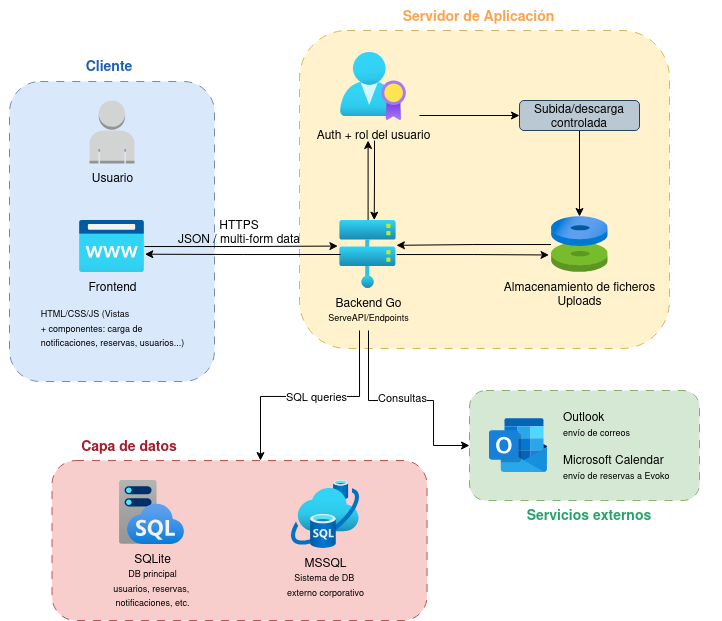

# CRMIntratools

Estre proyecto implementa un sistema modular para la gestión de diferentes necesidades del centro.

## Versiones disponibles

- [v0.1 - Primera versión estable](v0-1.md)
- [v1.3 - Hasta módulo 7 desarrollado](v1-3.md)
- [v1.4 - Document viewer](v1-4.md)
- [v1.5 - Budgeting module](v1-5.md)
- [v1.6 - Versión actual](v1-6.md)

## Arquitectura general

- **Backend:** GoLang 
- **Frontend:** HTML + CSS + JavaScript con uso de varios frameworks según necesidades. Principalmente, Bootstrap para formateo.
- **SQLite:** Base de datos principal guardada en /Data.
- **MSSQL:** Conexión con las otras bases de datos del centro.




## Sistema de tutoriales (onboarding guiado)

La aplicación incorpora un sistema de tutoriales interactivos en front-end, con persistencia por usuario y pantalla.

### Funcionamiento general

El tutorial se inicializa desde JavaScript con una lista de pasos (`steps`) compuesta por:

- `element`: selector CSS del elemento a resaltar.
- `title`: título del paso.
- `message`: texto explicativo.
- `position`: posición del tooltip (`top`, `bottom`, `left`, `right`, `center`).

El motor (`GUI/assets/js/tutorials/tutorialEngine.js`) comprueba si el usuario ya completó ese tutorial para el par `module + page`.  
Si no está completado, muestra overlay, resaltado del elemento y tooltip con navegación paso a paso.

### Lógica front-end

Archivos principales:

- `GUI/assets/js/tutorials/tutorialEngine.js`
  - Inicializa tutorial (`initTutorial`).
  - Consulta estado (`/api/tutorial/status`).
  - Renderiza overlay/tooltip y resaltado.
  - Permite avanzar, cerrar temporalmente o marcar como no volver a mostrar.
- `GUI/assets/js/tutorials/tutorial_main.js`
  - Define los pasos del tutorial de la pantalla principal.
  - Genera pasos dinámicos según módulos visibles para el usuario.
  - Lanza `initTutorial(steps, "main", "home")`.

Comportamientos relevantes:

- Si un `element` no existe (por rol/filtros), ese paso se salta automáticamente.
- En el último paso, el botón cambia a finalización del tutorial.
- `resize` reposiciona tooltip y resaltado para mantener coherencia visual.

### Lógica back-end (goworkers)

Archivo: `goworkers/tutorial.go`

Endpoints:

- `GET /api/tutorial/status?module={module}&page={page}`
  - Devuelve `{ "completed": true|false }`.
- `POST /api/tutorial/complete`
  - Body: `{ "module": "...", "page": "..." }`
  - Guarda el tutorial como completado para el usuario actual.
- `POST/GET /api/tutorial/reset` (según ruta configurada)
  - Elimina progreso del usuario para volver a mostrar tutoriales.
- `GET /api/tutorial/check-role`
  - Devuelve el rol del usuario autenticado.

### Persistencia en base de datos

Tabla utilizada: `tutorial_progress`

Campos lógicos usados por el sistema:

- `user_id`
- `module_name`
- `page_name`

La clave funcional es: **un usuario solo ve una vez cada tutorial por combinación `module/page`**, salvo que se resetee su progreso.

## Acceso y modificación del sello electrónico visible en PDFs

### 1. Descripción general

El sistema genera certificados PDF de auditoría presupuestaria y posteriormente los firma mediante un certificado digital de aplicación. La firma tiene dos componentes:

1. **Firma criptográfica del PDF**  
   Garantiza que el documento no ha sido modificado después de ser firmado.

2. **Sello visible en el documento**  
   Muestra visualmente un recuadro con el logo del centro, el texto del sello y la fecha de firma.

La firma se realiza mediante un script externo ubicado en:

```bash
/opt/crmintratools/pdf-signer
```

Este script es invocado desde el backend Go después de generar el PDF.

---

### 2. Archivos principales

#### Script de firma

```bash
/opt/crmintratools/pdf-signer
```

Este archivo contiene la lógica que:

- recibe el PDF generado por Go;
- recibe la posición donde debe aparecer la firma;
- genera una imagen temporal del sello visible;
- firma el PDF usando `pyHanko`;
- devuelve el PDF firmado.

Para editarlo:

```bash
sudo nano /opt/crmintratools/pdf-signer
```

Para validar que no tiene errores de sintaxis:

```bash
bash -n /opt/crmintratools/pdf-signer
```

---

#### Imagen de fondo del sello

```bash
/opt/crmintratools/assets/crm-logo-watermark.png
```

Esta imagen se usa como fondo visual del sello. Contiene el logo del centro en modo marca de agua.

Para ver si existe:

```bash
ls -l /opt/crmintratools/assets/crm-logo-watermark.png
```

---

#### Certificado digital de aplicación

En producción se encuentra ubicado en:

```bash
/srv/crmintratools/SSLCerts/crmintratools-app.p12
```

Este certificado es el que permite firmar digitalmente los PDFs.

---

### 3. Modificar el texto visible del sello

El texto visible del sello se modifica dentro de:

```bash
/opt/crmintratools/pdf-signer
```

En el bloque:

```bash
convert "$BACKGROUND" \
  -resize 900x290\! \
  -font "$FONT" \
  -fill "#111111" \
  -pointsize 36 \
  -annotate +45+95 "SEGELL ELECTRÒNIC" \
  -pointsize 30 \
  -annotate +45+145 "Centre de Recerca Matemàtica" \
  -pointsize 28 \
  -annotate +45+190 "$SIGN_DATE" \
  "$STAMP_IMAGE"
```

Cada línea `-annotate` dibuja una línea de texto sobre el sello.

Por ejemplo:

```bash
-annotate +45+95 "SEGELL ELECTRÒNIC"
```

significa:

```text
+45  posición horizontal
+95  posición vertical
```

Cuanto menor sea el primer número, más a la izquierda aparece el texto.  
Cuanto mayor sea el primer número, más a la derecha aparece el texto.  
Cuanto menor sea el segundo número, más arriba aparece el texto.  
Cuanto mayor sea el segundo número, más abajo aparece el texto.

---

### 4. Cambiar el tamaño de letra

El tamaño de letra se controla mediante `-pointsize`.

Ejemplo:

```bash
-pointsize 36 \
-annotate +45+95 "SEGELL ELECTRÒNIC" \
```

Para hacer el texto más pequeño:

```bash
-pointsize 32 \
```

Para hacerlo más grande:

```bash
-pointsize 40 \
```

---

### 5. Cambiar el color o fuerza del texto

El color se controla con:

```bash
-fill "#111111"
```

Para texto más oscuro:

```bash
-fill "#000000"
```

Para texto algo más suave:

```bash
-fill "#333333"
```

No se recomienda usar `-stroke` salvo que sea necesario, porque puede hacer que el texto quede demasiado grueso.

---

### 6. Modificar la posición del logo del sello

El logo de fondo se genera como imagen de marca de agua. Para hacerlo más pequeño y colocarlo a la derecha:

```bash
convert /srv/crmintratools/GUI/module8/assets/images/logo.png \
  -resize 300x120 \
  -alpha set \
  -channel A \
  -evaluate multiply 0.40 \
  +channel \
  /tmp/crm-logo-small.png
```

Después se genera la imagen final del sello:

```bash
convert -size 900x290 xc:white /tmp/crm-logo-small.png \
  -gravity east \
  -geometry +45+0 \
  -composite \
  /tmp/crm-logo-watermark-final.png
```

Y se copia a la ruta usada por el firmador:

```bash
sudo cp /tmp/crm-logo-watermark-final.png /opt/crmintratools/assets/crm-logo-watermark.png
sudo chmod 644 /opt/crmintratools/assets/crm-logo-watermark.png
```

---

### 7. Ajustar la transparencia del logo

La transparencia se controla con esta parte:

```bash
-evaluate multiply 0.40
```

Valores recomendados:

```text
0.25  muy transparente
0.35  transparente suave
0.40  equilibrado
0.50  más visible
0.60  muy visible
```

Ejemplo para hacerlo más visible:

```bash
-evaluate multiply 0.50
```

Ejemplo para hacerlo más suave:

```bash
-evaluate multiply 0.30
```


## Glosario

- **Módulo:** Sección de la aplicación con una función concreta (p. ej., reservar salas, perfil, administrar usuarios).
- **Usuario:** Persona que puede entrar a la aplicación con nombre de usuario y contraseña.
- **Rol:** Nivel de permisos del usuario (p. ej. User, Admin, Manager, Support). Define qué puede ver y hacer.
- **Frontend:** Lo que ve y usa el usuario (pantallas HTML, botones, formularios).
- **Backend:** La parte “servidor” que procesa las acciones (guardar datos, validar permisos, enviar emails).
- **Base de datos:** Lugar donde se guarda la información (usuarios, reservas, notificaciones…).
- **SQLite:** Base de datos “local” (un fichero) que usa la app como principal.
- **MSSQL:** Base de datos corporativa externa a la que el sistema se conecta.
- **Tabla:** “Hoja” dentro de la base de datos (por ejemplo, users, people, roomBooking).
- **Registro/entrada:** Una fila de una tabla (p. ej., una reserva concreta).
- **API:** Puerta de entrada para que el frontend pida cosas al backend (consultar, crear, borrar…).
- **Endpoint:** Dirección concreta de la API (como un “botón invisible” al que se llama desde la web).
- **Acción (action=...):** Parámetro que indica qué operación concreta quieres ejecutar dentro del endpoint.
- **Métodos HTTP (GET/POST/PUT/DELETE):**
    - **GET:** pedir/ver datos
    - **POST:** crear algo nuevo
    - **PUT:** modificar algo existente
    - **DELETE:** eliminar algo
- **JSON:** Formato de datos que viaja entre frontend y backend (como un formulario “en texto”).
- **Logs:** “Historial técnico” de lo que pasa (errores, acciones, eventos importantes).
- **Encriptación / cifrado:** Convertir información en ilegible sin clave (por seguridad).