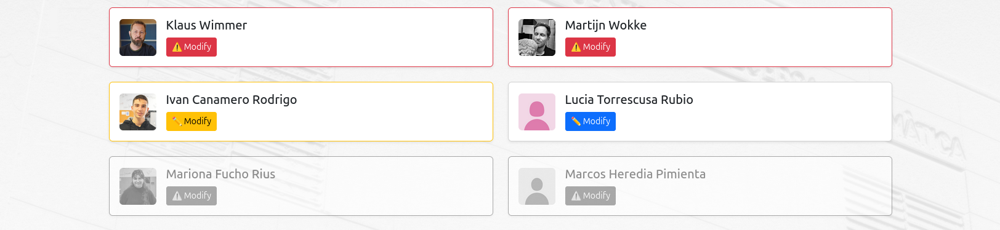
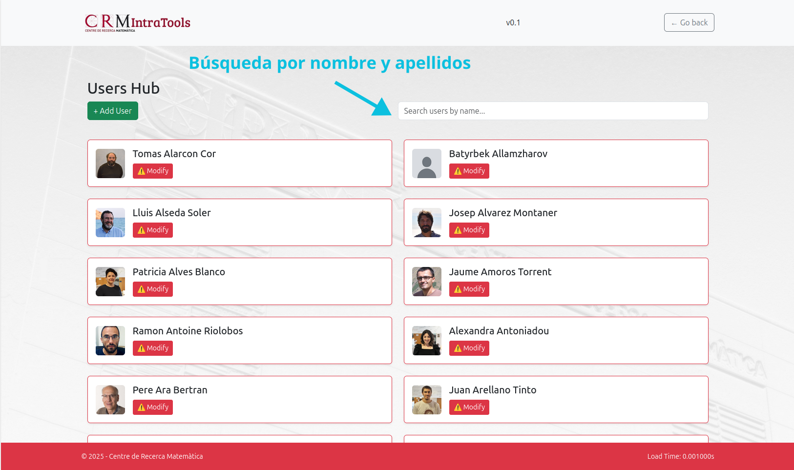

# Módulo 4 – Manage data v1.3

## Introducción

El módulo `Manage Data` es el componente central del sistema encargado de la gestión avanzada de datos del personal, grupos, formaciones, notificaciones y spin-offs.  
Integra toda la lógica necesaria para crear, editar, eliminar y consultar registros de las tablas relacionadas con `people` y sus entidades asociadas.

1 - Users Hub: 
    Este apartado permite añadir trabajadores y modificar los ya existentes. 
    A nivel visual, salen con un borde rojo aquellos usuarios de los que falte información obligatoria, con borde amarillo de los que falte información importante (p. ej. necesaria para hacer la exportación UNEIX) y sin borde aquellos que tengan toda la información relevante. 
    Además, con tal de no borrar información de antiguos trabajadores y poder recuperarla en caso de que volvieran, aquellos antiguos trabajadores salen al final de la lista en gris, ya que tienen el campo `active` de la tabla `people` desactivado. 

2 - Manage Groups: 
    Este apartado maneja la creación y modificación de grupos de investigación. Además, también se les puede añadir y quitar trabajadores, indicando la fecha en la que se añadieron al grupo y otros datos relevantes. Esta última funcionalidad también se puede realizar al inrevés desde Users Hub, añadiendo un grupo a una persona, pero este grupo debe existir previamente, habiéndose creado en este apartado o bien directamente desde la base de datos. 

3 - Manage Trainings:
    Gestión de formaciones internas o externas, incluyendo creación, edición, eliminación y asignación de participantes.

4 - Manage Spin Offs:
    Administración de empresas o iniciativas derivadas (spinoffs).

5 - Make Announcement:
    Apartado dedicado a enviar comunicados a los usuarios del sistema, con la opción de adjuntar documentos e indicar quién los recibe.

Este módulo también maneja un sistema de actualizaciones diarias de la base de datos que se realiza cada medianoche, con el código de `cron.go`. Este código cambia el estado del campo `active` de la tabla `people` a 0 en caso de que el contrato se haya acabado, y a 1 en caso de que vaya a comenzar. También se encarga de actualizar el campo `outdated` de `researchGroup` cuando pasa la fecha de finalización de un grupo, y de avisar a RRHH cuando quedan 15 días para la finalización de un contrato.

Por último, el acceso a los datos protegidos de los trabajadores se delimita desde los `ajustes` del módulo, al que solo tienen acceso los administradores.

## Base de datos

Para este apartado se han creado diversas tablas, que se pueden diferenciar en tablas que guardan datos de usuarios y tablas que guardan opciones:

1 - OPTION TABLES: Añadir una entrada a estas tablas hará que aparezca reflejado en las opciones del formulario

- `cities`: código - nombre de ciudad.
- `provinces`: código - nombre de provincia.
- `country`: código - nombre de país - nombre nacionalidad.
- `educationGrade`: código - nombre nivel de estudios máximo.
- `researchArea`: código - nombre - categoría de área de investigación.
- `studies`: código - nombre del grado estudiado.
- `universities`: código - nombre de las universidades.
- `researchGroup`: código interno - código de investigación - nombre y otra información relevante a los grupos de investigación.
- `training`: información relativa a las formaciones.

2 - DATA TABLES:

- `people`: información relacionada con los trabajadores. Tabla principal.
- `contract`: contrato(s) de cada trabajador.
- `users`: aquel trabajador (entrada de people) con contrato de tipo 'Contracted worker' se le creará automáticamente un usuario para acceder al sistema.
- `people_grade`: estudio(s) de los trabajadores.
- `people_group`: grupo(s) a los que pertenece un trabajador e información relevante.
- `people_nationality`: nacionalidad(es) de los trabajadores.
- `people_phd`: phd(s) de los trabajadores.
- `people_training`: formacion(es) de los trabajadores.
- `people_supervisor`: supervisor(es) de los trabajadores.
- `residence`: residencia(s) de los trabajadores.
- `responsible`: en caso de que un trabajador esté haciendo un phd (tenga entrada a people_phd) se le pueden asociar responsables.

3 - NOTIFICATION TABLES:

- `notification`: crea la notificación con su contenido e información de cración. 
- `notification_user`: cada entrada representa una persona que recibirá la notificación con 'notification_id' indicado y otros campos de permisos. 'profile_applied' DERANGED.

## Estructura de archivos

BACK-END /Modules/module4/

|   Archivo   | Descripción   |
|-------------|---------------|
| `main.go`   | Inicia el servidor del módulo 4.|
| `api.go`    | Contiene la función principal `serveAPI`, que maneja peticiones POST, GET y DELETE |
| `types.go`  | Define estructuras que permiten construir las peticiones json. |
| `utils.go`  | Funciones auxiliares para cada apartado |
| `server.go` | Configura y lanza el servidor HTTPS con rutas locales.  |
| `cron.go` | Gestiona los eventos que suceden diariamente. |

Los ficheros utils.go y api.go están separados por apartados y cada función comentada con su utilidad.

---

FRONT-END /GUI/module4/

|    Archivo       | Descripción   |
|---------------|------------------|
| `index.html`    | Vista inicial. Muestra las tarjetas para poder acceder a cada apartado. |
| `user.html` | Muestra la lista de trabajadores y se define el modal para modificar sus datos.  |
| `trainings.html` | Vista general de **Trainings**. Permite visualizar, crear y editar formaciones. Incluye un botón para añadir nuevas formaciones y acceder a los miembros asociados. |
| `trainingMembers.html` | Vista de gestión de participantes de una formación. Permite añadir o eliminar trabajadores vinculados a un curso de formación, con fechas de inscripción y estado. |
| `spinoff.html` | Vista dedicada a la gestión de **Spin-offs**. Permite visualizar, añadir, modificar o eliminar spin-offs, indicando su nombre, responsable, relación con grupos y fechas relevantes. |
| `notifications.html` | Vista del apartado **Make Announcement**. Desde aquí se pueden crear notificaciones o comunicados, adjuntar archivos, definir destinatarios (todos, algunos o todos excepto algunos usuarios) y enviarlos. |
| `groups.html` | Vista de **Manage Groups**. Muestra todos los grupos de investigación existentes, con la opción de crear nuevos grupos o editar los existentes. |
| `groupMembers.html` | Vista para gestionar los miembros de un grupo de investigación. Permite añadir o eliminar personas, indicando la fecha de entrada/salida y su rol (IP, colaborador, etc.). |

---

/GUI/module4/assets/js

|      Archivo    | Descripción  |
|-----------------|--------------|
| `addUserModal.js`  | Formato de cada campo según su tipo de información. De especial importancia las secciones `repeater`, que deben tener un formato especial para su correcto funcionamiento. Hay que tener en cuenta, además, el campo responsible, que al ser una sección `repeater` dentro de otra del mismo tipo, se debe formatear independientemente al resto. |
| `formOptions.js`    | En este fichero se definen los conjuntos de opciones que se mostrarán en los campos seleccionables. Está el estático, que se define al principio del fichero y se pueden añadir opciones dentro de cada lista, y el importado a partir de la base de datos, al final del fichero, que se puede modificar a partir de la misma. |
| `fieldConfig.js`    | En userFieldSections se definen los campos que se visualizan en la vista, con su relación de nombre front-end y el nombre que le llega desde el backend (en algunos casos para evitar confusiones, el nombre que le llega desde el backend es distinto al que se encuentra en la base de datos. La correlación bd - backend se encuentra en utils.go, en la función handleGetUneixUsers). En formSources se define por cada campo seleccionable, qué conjunto de opciones se muestra. |
| `fieldRequirements.js`     | Define el conjunto de campos necesarios. requiredFields son los campos obligatorios, que hará que si no contienen información se visualicen con el borde rojo, e importantFields de la misma manera en naranja. Se pueden editar añadiendo el nombre de backend del campo a las listas. |
| `fieldDependencies.js`  | Bloquea y desbloquea campos según la información que se va introduciendo, de manera que quede reflejada los campos necesarios a rellenar según el tipo de trabajador. |
| `uneixManager.js` | Da formato a la visualización de la lista de trabajadores, los ordena y otorga los colores. Define la barra del buscador. |
| `photoUpload.js`    | Importa cropper para mejorar la experiencia de subir una fotografía de perfil y permite recortarla desde la aplicación. |
| `groupManager.js` | Gestiona la vista **groups.html**. Carga la lista de grupos desde el backend, permite crear, editar o eliminar grupos, y enlaza con la vista `groupMembers.html`. |
| `groupMembers.js` | Controla la asignación de miembros a un grupo. Gestiona las fechas de incorporación, roles y eliminación de miembros. Se comunica con los endpoints `addGroupMember`, `saveGroupMembers`, etc. |
| `trainingManager.js` | Gestiona la vista **trainings.html**. Carga todas las formaciones disponibles, permite crear o modificar una formación, y acceder a los miembros inscritos. |
| `trainingMembers.js` | Controla la gestión de participantes de una formación. Permite añadir trabajadores, definir su estado (inscrito/completado), y eliminar registros. |
| `spinoffsManager.js` | Controla la vista **spinoff.html**. Permite crear y editar spinoffs. |

## Flujo general de uso

1. **Acceso al módulo**  
    Desde `index.html` se puede acceder a **Users Hub**, **Groups**, **Trainings** o **Spin-offs**, además de poder crear notificaciones desde **Make Announcement**.

2. **Visualización de usuarios: USERS HUB**  
   - El frontend llama al endpoint `?action=allUneixUsers` para obtener todos los usuarios.
   - Los usuarios se muestran con colores según su estado:
     - **Rojo:** falta información obligatoria (`requiredFields`).
     - **Amarillo:** falta información importante (`importantFields`).
     - **Gris:** usuarios inactivos (`active = 0`).

     

3. **Búsqueda y filtrado**  
   Se puede buscar por nombre o apellido en tiempo real mediante `uneixManager.js`.

   

4. **Añadir o editar usuario**  
   - El botón **+ Add User** abre el modal (`addUserModal.js`) con un formulario dinámico.
   - Las dependencias entre campos se gestionan con `fieldDependencies.js`.

   

   

5. **Subida de imagen**  
   Se abre un modal para recortar la foto de perfil con en caso de que esta no sea cuadrada `cropper.js`.

   

6. **Guardar datos**  
   - El formulario se envía al endpoint `?action=saveUser`, que ejecuta `handleSaveUser`.
   - Este proceso inserta o actualiza datos en la tabla `people` y sus tablas relacionadas.
   - Se gestionan archivos adjuntos (contratos, diplomas, etc.) en `Uploads/00_Users/{id_username}/`.

   

7. **Carga de opciones dinámicas**  
   Las listas desplegables se rellenan con el endpoint `?action=get-options` (`handleGetOptions`).

8. **Gestión de grupos, formaciones y spin-offs**  
   - Los apartados `groups.html`, `trainings.html` y `spinoff.html` permiten visualizar y editar cada entidad.  
   - Cada uno tiene su propio archivo JS de gestión (`groupManager.js`, `trainingManager.js`, `spinoffsManager.js`).  
   - Se utilizan vistas complementarias (`groupMembers.html`, `trainingMembers.html`) para gestionar las relaciones entre usuarios y entidades.  

9. **Envío de notificaciones (Make Announcement)**  
   - Desde `notifications.html` se pueden crear comunicados internos.  
   - Se puede adjuntar un archivo, definir destinatarios específicos o excluir algunos usuarios.  
   - Los mensajes se almacenan en las tablas `notification` y `notification_user`.  

10. **Actualización automática de contratos**  
    Cada medianoche, el sistema ejecuta un proceso (cron) que **desactiva automáticamente a los usuarios con contrato vencido**, cambiando su estado a `inactive` (`active = 0`).  
    Este proceso se inicia automáticamente con el servidor y registra su actividad en los logs cifrados.

## Endpoints

**Base URL:**  
`https://<host>/module4/api?action=<action>`

### Users Hub

| Acción | Método | Descripción | Handler |
|--------|--------|-------------|---------|
| `get-options` | GET | Devuelve las opciones para los campos del formulario | `handleGetOptions` |
| `allUneixUsers` | GET | Devuelve toda la información de los usuarios | `handleGetUneixUsers` |
| `saveUser` | POST | Inserta o actualiza un usuario con sus tablas asociadas | `handleSaveUser` |
| `getUserProfile` | GET | Devuelve el perfil completo de un usuario (people, contracts, phd, etc.) | `handleGetUserProfile` |

### Notificaciones y seguridad

| Acción | Método | Descripción | Handler |
|--------|--------|-------------|---------|
| `getNotifications` | GET | Devuelve todas las notificaciones del usuario | `handleGetNotifications` |
| `markNotificationSeen` | PUT | Marca una notificación como leída | `handleMarkNotificationSeen` |
| `deleteNotification` | DELETE | Elimina una notificación (si no hay más destinatarios) | `handleDeleteNotification` |
| `changePassword` | POST | Actualiza la contraseña del usuario | `handleChangePassword` |

### Grupos de investigación

| Acción | Método | Descripción | Handler |
|--------|--------|-------------|---------|
| `allGroups` | GET | Devuelve todos los grupos registrados | `handleGetAllGroups` |
| `getGroupMembers` | GET | Lista los miembros de un grupo | `handleGetGroupMembers` |
| `saveGroup` | POST | Crea o actualiza un grupo | `handleSaveGroup` |
| `addGroupMember` | POST | Añade un miembro a un grupo existente | `handleAddGroupMember` |
| `getAvailableUsersForGroup` | GET | Lista los usuarios disponibles para añadir al grupo | `handleGetAvailableUsersForGroup` |

### Formaciones (Trainings)

| Acción | Método | Descripción | Handler |
|--------|--------|-------------|---------|
| `allTrainings` | GET | Devuelve todas las formaciones | `handleGetAllTrainings` |
| `saveTraining` | POST | Crea o actualiza una formación | `handleSaveTraining` |
| `deleteTraining` | DELETE | Elimina una formación existente | `handleDeleteTraining` |
| `getTrainingMembers` | GET | Lista los participantes de una formación | `handleGetTrainingMembers` |
| `addTrainingMember` | POST | Añade un participante a una formación | `handleAddTrainingMember` |
| `getAvailableUsers` | GET | Lista los usuarios disponibles para una formación | `handleGetAvailableUsers` |

### Spin-offs

| Acción | Método | Descripción | Handler |
|--------|--------|-------------|---------|
| `allSpinoffs` | GET | Devuelve todos los spin-offs registrados | `handleGetSpinoffs` |
| `saveSpinoff` | POST | Crea o actualiza un spin-off | `handleSaveSpinoff` |
| `deleteSpinoff` | DELETE | Elimina un spin-off | `handleDeleteSpinoff` |
